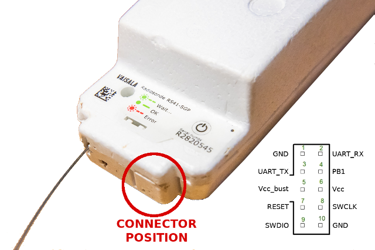
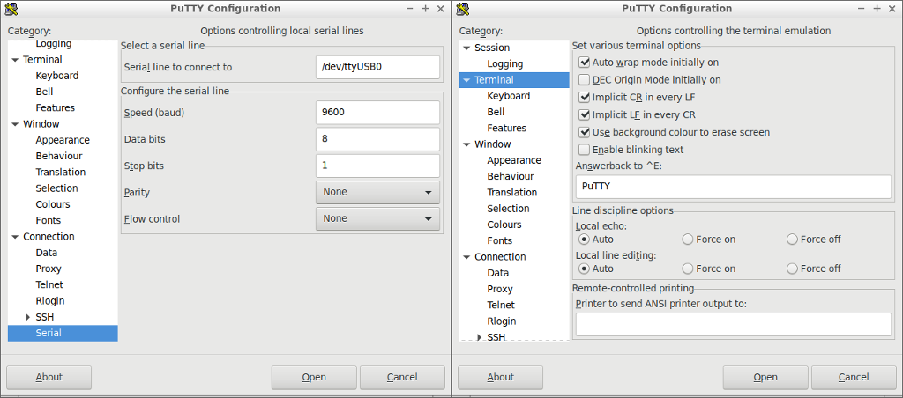
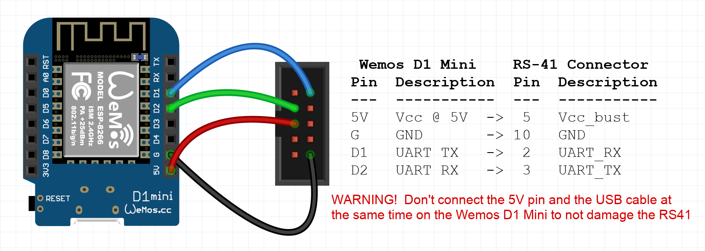
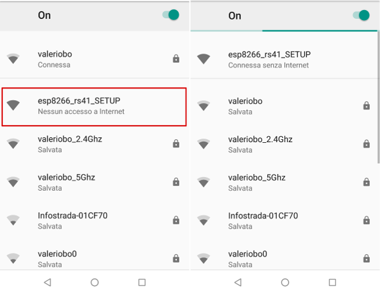
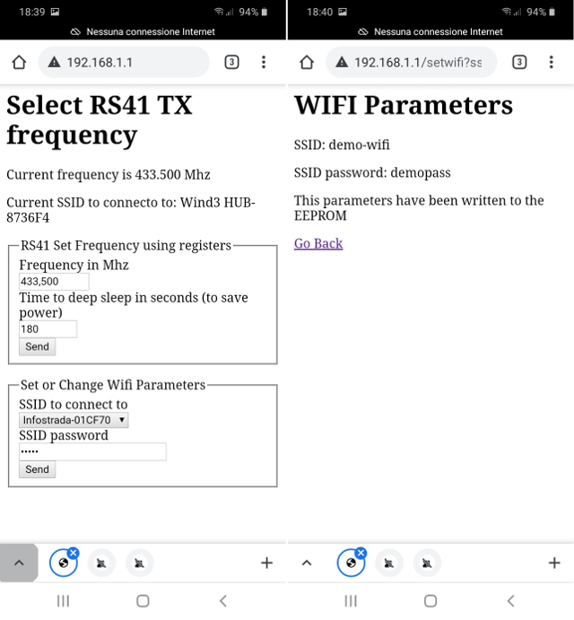
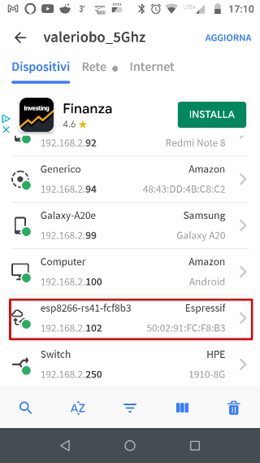
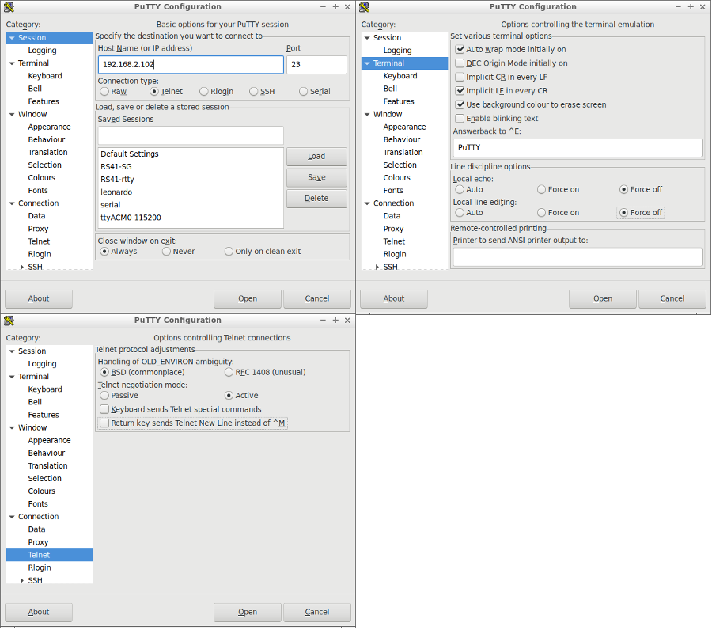

# About

If you are a
[radiosonde hunter](https://www.wired.com/story/radiosonde-hunters/)
and a ham radio operator and have found one, or more,
[Vaisala RS-41](https://www.vaisala.com/en/products/instruments-sensors-and-other-measurement-devices/soundings-products/rs41)
[Radiosonde](https://en.wikipedia.org/wiki/Radiosonde) and want to
re-use them with the original firmware, but operating on radio amateur
frequencies, this is the project for you.

This project use a
[Wemos D1 Mini](https://www.wemos.cc/en/latest/d1/d1_mini.html), an
arduino-like board that is based on the WiFi enabled chip ESP8266, to
automatically setup an amateur radio frequency on the RS-41 at each
boot.

This board is small enough to fit inside the original polystyrene
shell, with some minor shell modifications.

This small board will be powered by the RS-41 and, soon after boot, will:

- modify the RS-41 registers to set the selected frequency in the 70
  cm radio amateur band through the serial interface;
- try to connect to the pre-selected WiFi access point, if this fail
  it will start in Access Point mode and will accept a client
  connection from a mobile phone or laptop;
- start a web browser to allow:
  - the selection of the RS-41 transmit frequency, related register
    values are calculated from frequency entered
  - the time needed to go in deep sleep mode to save energy
  - and the WiFi SSID and password to connect to, at the next reboot;
- start also a telnet server that will act as a bridge between the
  telnet connection and the RS-41 serial interface; this will allow an
  easy modification of other RS-41 parameters like the callsign or the
  initial TX power. These parameters will be stored by the RS-41 and
  will survive reboots.

# RS41 connector pinout 



The RS-41 has a connector on the front, an unusual connector with a 2
mm pin pitch instead of the usual 2.54 mm (0.1 inch), this means that
it is quite difficult to attach the typical "Dupont" jumper wires, so
common in the Arduino environemt, that have a 2.54 mm pitch.

The pinout of this connector is:

1. **GND** - Ground
2. **UART RX** - Serial port RX, TTL levels (0V / 3.3V)
3. **UART TX** - Serial port TX, TTL levels (0V / 3.3V)
4. **PB1** - Unknown purpose
5. **Vcc bust** - About 3.75V when the Radiosonde is ON, 0V when it is OFF
6. **Vcc** - About 3.3V, goes down to about 3V when batteries are
   low. The value remains about the same when the Radiosonde is ON or
   is OFF;
7. **RESET** - Reset to the MCU, often used by the SWD interface
   probes, active low
8. **SWCLK** - Clock of the
   [SWD (Serial Wire Debug) interface](https://wiki.segger.com/SWD) of
   the
   [STM32F100C8](https://www.st.com/en/microcontrollers-microprocessors/stm32f100c8.html)
   micro-controller
9. **SWDIO** - Data Input/Output of the [SWD (Serial Wire Debug) interface](https://wiki.segger.com/SWD)
10. **GND** - Ground

# The Serial Interface

It is possible to connect the RS41 serial interface to a PC using a
USB TTL Serial Adapter,
[(something similar to this)](https://www.amazon.com/USB-Serial-Adapter-Converter-Communication/dp/B0766383FL);
it is important to pay attention at the adapater voltage, it must be
3.3V. If you use a 5V adapter, probably you will destroy your RS41.

You can use a terminal emulator software, like the excellent
[PuTTY](https://www.putty.org/), with the following connection settings:

* speed: 9600 baud
* parity: none
* number of bits: 8
* number of stop bits: 1
* hardware flow control: none
  
The RS41 uses a single Carriage Return byte (hex 0D, decimal 13, char
^M) as end of line marker, instead of the more common 2 bytes sequence
of Carriage Return and Line Feed; for this reason it is important to
set accordingly the terminal emulator. In the case of PuTTY the
settings are shown on the following screenshots:



On Windows PC the serial line will be something like COM6, COM7 or
similar name, you can look at the "Device Manager" to find the correct
serial interface name.

## The Boot message

With the serial interface connected to the PC and the terminal
emulator software running, if we power-on the RS41 we get
the following text on the terminal:

```
Vaisala RS41 Radiosonde SW V2.02.14
Copyright (c) Vaisala Oyj 2016. All rights reserved.
Serial number: NOCALL-0
Transmitter frequency: 404.80 MHz
Transmitter power: 0/7

Enabled TX
```

## The hidden service menu

Few smart peoples (like Rolf DF9DQ and Mirko IZ4PNN) have found a way
to access the RS41 configuration menu through the UART interface:
after the above text has been printed, wait few seconds and then type
the following string, that will not be echoed back:

```
Enter (press the "Enter" key)
STwsv
Enter (press the "Enter" key)
```

I have found that the above keys must be typed slowly, if you type too
fast the service menu will not be shown.

The following service menu will be printed on the terminal:

```
(S)ensors         Fre(q)uencies  (P)arameters    (A)lfa           TX p(o)wer
TX (f)requency    T(X) state     (T)X registers  TX contin(u)ous  TX ran(d)om
TX (c)arrier      (B)aud rate    Ser(i)al no     (R)ed LED info   (N)o menu
(K)eep test mode  S(W) version   (M)easurements  (L)aunch/Drop    (E)xit
>
```

## The most interesting service menu options

From an amateur radio operator point of view, wishing to re-use the
RS41 Radiosonde in the amateur radio bands the most interesting
commands are those that allows to change the callsign (or *serial
number*) and the frequency.

### Change the Radiosonde callsign

Typing the "i" key to select the "**Ser(i)al no**" menu, it is
possible to replace the serial number of the Radiosonde with our own
ham radio callsign:

```
(S)ensors         Fre(q)uencies  (P)arameters    (A)lfa           TX p(o)wer
TX (f)requency    T(X) state     (T)X registers  TX contin(u)ous  TX ran(d)om
TX (c)arrier      (B)aud rate    Ser(i)al no     (R)ed LED info   (N)o menu
(K)eep test mode  S(W) version   (M)easurements  (L)aunch/Drop    (E)xit
>i
Serial number P2720454 >IU4OKB-6
```

This setting will survive reboots. But pay attention to not broadcast
your callsign outside of the amateur radio bands!

### Change the Radiosonde transmit frequency

Typing the "f" key to select the "**TX (f)requency**" service menu option
it is possible to change the TX frequency, but only from 400 Mhz to
405.99 Mhz. To select a frequency inside one of the radio amateur
bands there is a workaround using the TX registers (see below).

```
(S)ensors         Fre(q)uencies  (P)arameters    (A)lfa           TX p(o)wer
TX (f)requency    T(X) state     (T)X registers  TX contin(u)ous  TX ran(d)om
TX (c)arrier      (B)aud rate    Ser(i)al no     (R)ed LED info   (N)o menu
(K)eep test mode  S(W) version   (M)easurements  (L)aunch/Drop    (E)xit
>f
TX frequency  404.60 >404.80
```

This setting will survive reboots.

### Enable/Disable transmission

Typing the "x" key to select the "**T(X) state**" it is possible to
disable the radio transmission and to re-enable it. This can be useful
during our testing of the Radiosonde interface, to prevent
transmissions that could be picked-up by some nearby receiver and
forwarded to sites like radiosondy.info.

```
(S)ensors         Fre(q)uencies  (P)arameters    (A)lfa           TX p(o)wer
TX (f)requency    T(X) state     (T)X registers  TX contin(u)ous  TX ran(d)om
TX (c)arrier      (B)aud rate    Ser(i)al no     (R)ed LED info   (N)o menu
(K)eep test mode  S(W) version   (M)easurements  (L)aunch/Drop    (E)xit
>x
TX disabled
```

This setting **will not** survive reboots.

### Select the transmission power

Typing the "o" key to select the "**TX p(o)wer**" it is possible to
select a value from 0 to 7 to select the transmission power. To be
precise this is the transmission power when the Radiosonde is not in
flight mode, when it will enter "flight mode", probably above 1000 m
altitude, it will switch to maximum power.

This value will go into one of the
[Si4032](https://www.silabs.com/documents/public/data-sheets/Si4030-31-32.pdf)
registers and, according to his databook, the transmission power is
listed below, but please note that the actual power can be different
because it depends also on the actual circuit and PCB layout:

|Value|Powr dBm|Power mW|
|:---:|-------:|-------:|
|0    |  +1 dBm|  1.3 mW|
|1    |  +2 dBm|  1.6 mW|
|2    |  +5 dBm|  3.2 mW|
|3    |  +8 dBm|  6.3 mW|
|4    | +11 dBm| 12.6 mW|
|5    | +14 dBm| 25.1 mW|
|6    | +17 dBm| 50.1 mW|
|7    | +20 dBm|100.0 mW|

It can be useful to reduce the power to the minum level during our
testing with the Radiosonde, to reduce the risk that the transmissions
could be picked-up by some nearby receiver and forwarded to sites like
radiosondy.info.

```
(S)ensors         Fre(q)uencies  (P)arameters    (A)lfa           TX p(o)wer
TX (f)requency    T(X) state     (T)X registers  TX contin(u)ous  TX ran(d)om
TX (c)arrier      (B)aud rate    Ser(i)al no     (R)ed LED info   (N)o menu
(K)eep test mode  S(W) version   (M)easurements  (L)aunch/Drop    (E)xit
>o
TX power (0-7) 3 >0
```

This setting will survive reboots.

### Select the frequency inside the 70 cm radio amateur band

One interesting service menu is the "**(T)X registers**", typing the
"t" key, it is possible to change the value of one of the 7F available
registers. These are the
[Si4032](https://www.silabs.com/documents/public/data-sheets/Si4030-31-32.pdf)
registers, this means that changing these values it is possible to
modify the beahviour of tha radio chip; of particular interest is
changing the value of the registers 0x75, 0x76 and 0x77 that are
responsible for the TX frequency. Modifying these registers is
possible to select a frequency from 208 Mhz to 832 Mhz. This seems
different from what is printed on the
[Si4032 datasheet](https://www.silabs.com/documents/public/data-sheets/Si4030-31-32.pdf)
(from 240 Mhz to 960 Mhz), but the reason is that the datasheet
assumes a PCB with a 30 Mhz crystal, instead on the RS41 there is a 26
Mhz crystal, for this reason all the frequencies listed on the
datasheet must be "re-scaled" multiplying them by 26/30. This also
means that it's not possible to use the 33 cm radio amateur band, but
only the 70 cm band.

How to calculate the value of these registers is explained in the
datasheet and in an excel spreadsheet available on the Silicon Labs
website. But in our case it is easier to use the
[calculator](https://www.makemehack.com/2020/12/how-to-change-the-tx-frequency-of-the-vaisala-rs41-radiosonde.html)
availble on my website. Anyway in this project the software running on
the Wemos D1 mini does this calculation and there is non need to know
the values of these registers.

An example changing these registers to set 433.500 Mhz is the
following (register 0x75=0x21, 0x76=0x02 and 0x77=0x67):

```
(S)ensors         Fre(q)uencies  (P)arameters    (A)lfa           TX p(o)wer
TX (f)requency    T(X) state     (T)X registers  TX contin(u)ous  TX ran(d)om
TX (c)arrier      (B)aud rate    Ser(i)al no     (R)ed LED info   (N)o menu
(K)eep test mode  S(W) version   (M)easurements  (L)aunch/Drop    (E)xit
>t
Register number (00-7F) >75
Register value 16 >21
OK

(S)ensors         Fre(q)uencies  (P)arameters    (A)lfa           TX p(o)wer
TX (f)requency    T(X) state     (T)X registers  TX contin(u)ous  TX ran(d)om
TX (c)arrier      (B)aud rate    Ser(i)al no     (R)ed LED info   (N)o menu
(K)eep test mode  S(W) version   (M)easurements  (L)aunch/Drop    (E)xit
>t
Register number (00-7F) >76
Register value B0 >02
OK

(S)ensors         Fre(q)uencies  (P)arameters    (A)lfa           TX p(o)wer
TX (f)requency    T(X) state     (T)X registers  TX contin(u)ous  TX ran(d)om
TX (c)arrier      (B)aud rate    Ser(i)al no     (R)ed LED info   (N)o menu
(K)eep test mode  S(W) version   (M)easurements  (L)aunch/Drop    (E)xit
>t
Register number (00-7F) >77
Register value EC >67
OK
```

These settings **will not** survive reboots, this is the reason why
this project was born!

# The software on this repository

The software on this repository is developed with the Aduino
toolchain, it is included in the *esp8266-rs41.ino* and in the include
file *OTAdual.h*, these are the only two files needed to compile the
software for the Wemos D1 mini.

The *Makefile* is optional and can be useful only in the Linux
environment and only using the *arduino-cli*, the command line based
Arduino environment.

Assuming that the *Wemos D1 mini* is connected, through the serial
interface, to the RS41 and that it is powerd by the RS41 it will do
the following steps:

1. Just after booting read the parameters stored on the EEPROM that
   are:

   - the frequency to setup using the TX registers, the values of the
     registers are calculated;
   - the time after boot, in secondos, that will be used to go to deep
     sleep mode to save power;
   - the SSID of the Access Point to connect to;
   - the password associated to the SSID;

   on first boot or if these parameters are not already stored on the
   EEPROM, it will select the default frequency 433.500 Mhz, 180
   seconds (3 minutes) as the time to deep sleep and a random SSID and
   password, so it will later fail to associate to an existing Access
   Point.

2. It will then send the "magic string" *([Enter]STwsv[Enter])*
   through the serial interface to the RS41 to enter the Service Menu.

3. It will input the register values, through the *(T)X registers*
   menu, to select the TX frequency. The value of these registers are
   automatically calculated.

4. It tries to connect to the Acces Point using the SSID stored in the
   EEPROM, if this association fails (for whatever reason like no SSID
   stored on EEPROM, invalid password or SSID not available etc.), it
   will start in Access Point mode advertising his own SSID that is
   *"esp8266_rs41_SETUP"*.

5. It then start a web server presenting a web form to select the
   frequency, that will be used at next reboot, to select the time to
   go to deep sleep mode and a link to another form to set the SSID
   and password to associate to, on next boot.

6. It will start a telnet server that is *bridged* to the serial port
   connected to the RS41, in this way it is possible to access the
   Service Menu through a simple telnet connection and without
   attaching more cables to the RS41 connector.

## Connecting the Wemos D1 mini to the RS41 connector



The *Wemos D1 mini* uses the
[ME6211 Voltage Regulator](https://datasheet.lcsc.com/szlcsc/Nanjing-Micro-One-Elec-ME6211A18M3G-N_C236677.pdf)
that has a wide operating voltage range, for this reason it is safe to
connect the *D1 mini* 5V input to the *Vcc_bust* pin of the RS41
connector that is about 3.7V. We cannot use the RS41 Vcc pin because
it is always at about 3.3V, also when the RS41 is powered off. The
*Vcc_bust* pin, instead, is at 0V when the RS41 is powered off.

The other pin connections are quite straightforward:

* D1 Mini ground to the RS41 connector ground
* D1 Mini D1 pin (software serial TX) to the UART_RX pin of the RS41 connector
* D1 Mini D2 pin (software serial RX) to the UART_TX pin of the RS41 connector

## Prerequisites to compile the software

To compile this software it is needed to setup the Arduino environment
to support the ESP8266 chip and the Wemos D1 Mini, there are a lot of
tutorials available on the web on how to do this, if not already done.

Some additional libraries are needed to:

- support WiFi connections as station and as Access Point
- support On the Air firmware updates
- implement the software serial interface on Wemos D1 mini, that has
  only serial port, the one used by the USB interface, to use a second
  serial port it is needed a software implementation that has limits
  but that, at 9600 baud, runs reasonably well;
- implement a simple interface to read/write few parameters in EEPROM

The complete list of libraries is the following, usually a version
higher than the one listed is ok:

```
Library Name                        Version    Author                    Architecture    Type
----------------------------------- ---------- ------------------------- --------------- -------
ArduinoOTA                          1.0        Ivan Grokhotkov and Migue esp8266         system
DNSServer                           1.1.1      Kristijan Novoselic       esp8266         system
EEPROM                              1.0        Ivan Grokhotkov           esp8266         system
ESP8266WebServer                    1.0        Ivan Grokhotkov           esp8266         system
ESP8266WiFi                         1.0        Ivan Grokhotkov           esp8266         system
ESP8266mDNS                         1.2        multiple, see files       esp8266         system
EspSoftwareSerial                   6.8.5      Peter Lerup, Dirk Kaar    esp8266,esp32   system
```

## Running the software

Once the software has been compiled and loaded into the *Wemos D1
Mini* and the *D1 mini* has been connected to the RS41 we can proceed
to power up the RS41 pushing the *switch* button for a couple of
seconds:

- The RS41 will boot and will start transmitting on the original
  frequency (for example on 404.80 Mhz), it will transmit a couple of
  packets before the *D1 Mini* will be able to change the frequency;

- The *D1 Mini* will boot, will power on the on board led and will set
  the frequency, using the *(T)X registers* service menu;

- The *D1 Mini* will power off the on board led, will start the WiFi,
  connecting to an Access Point or, if it fails, starting his own
  Access Point with the SSID *"esp8266_rs41_SETUP"*;

- The *D1 Mini* will start a web server and a telnet daemon;

- If the frequency setup on the RS41 was successfull the *D1 Mini*
  will start flashing the on board led with a slow speed (1 second on,
  1 second off), if the frequency setup failed, the *D1 Mini* will
  flash the on board led very fast (a couple of on/off per seconds);
  in this way, if the onboard led is visible, it is possible to
  understand if the frequency setup was successfull or not.

### Connecting to the Wemos D1 Mini

After the initial boot, the D1 Mini doesn't have anything stored on
the EEPROM, so it is unable to connect to an existing access point and
starts his own access point with the SSID *"esp8266_rs41_SETUP"* and
IP address 192.168.1.1.

It is possible to connect to this SSID and use a web browser to set
the frequency, the time to deep sleep and the SSID/password of an
access point to connect to as shown in the following images:



In the following image the SSID *wifi-demo* with the password
*demopass* has been selected:



It is important to understand security implications of these setup:

* the SSID password travels in clear between the browser and the Wemos
  D1 mini;
* the SSID password is stored in the Wemos D1 Mini EEPROM and it is
  sent from the D1 Mini to the browser in clear;
* having physical access to the D1 mini is very easy to get the SSID
  password.

### The Wemos D1 Mini connected to the Access Point

Once the D1 Mini has the SSID and related password stored in his
EEPROM, it will connect to the Access Point as a client station.

To connect to the D1 Mini web server or telnet server, from other
devices on the same WiFi/LAN network, like a laptop or a mobile
device, it is necessary to know his IP address. There are multiple way
to find this IP address:

* looking at information on the DHCP server, usually running on the
  WiFi Router/Access point, searching the mac address of the D1 Mini
  to find his IP address;

* on Linux, the simplest way is using the *avahi-browse* as in the
  following screenshot to find the IP address that is, in this case,
  192.168.2.102:

```
$ avahi-browse _arduino._tcp --resolve  --terminate
+   eth0 IPv4 esp8266-rs41-fcf8b3                           _arduino._tcp        local
=   eth0 IPv4 esp8266-rs41-fcf8b3                           _arduino._tcp        local
   hostname = [esp8266-rs41-fcf8b3.local]
   address = [192.168.2.102]
   port = [8266]
   txt = ["tcp_check=no" "ssh_upload=no" "board="ESP8266_WEMOS_D1MINI"" "auth_upload=no"]
```

* otherwise the simplest method is using the *Fing* application on the
  smartphone (available for Android and iOS) connected to the same
  WiFi network as in the following screenshot; the ethernet address
  manufacturer (*Espressif* in this case) and the hostname
  (*esp8266-rs41-fcf8b3* in this case) can be used to identify our
  device:
  
  

### Using telnet to access the RS41 Service Menu

A (sort of) telnetd daemon runs on the Wemos D1 Mini and will bridge
the telnet connection to the serial port connected to the RS41, in
this way it is possible to access, wirelessly, the RS41 service menu.

The telnet client usually negotiate options with the telnetd server,
but, in this case, we have a simple tcp server listening on port 23
and not a full blown telnetd daemon, for this reason it is important
to manually select the correct options in the telnet client.

Using the Linux telnet client we have to use the option *"set crmod"*
(When this mode is enabled, most carriage return characters received
from the remote host will be mapped into a carriage return followed by
a line feed) and *"mode character"* (Disable the TELNET LINEMODE
option), as in the following screenshot:

```
$ telnet 192.168.2.102 
Trying 192.168.2.102...
Connected to 192.168.2.102.
Escape character is '^]'.
^]
telnet> set crmod
Will map carriage return on output.
^]
telnet> mode character

## not visible: [Enter]STwsv[Enter]

(S)ensors         Fre(q)uencies  (P)arameters    (A)lfa           TX p(o)wer
TX (f)requency    T(X) state     (T)X registers  TX contin(u)ous  TX ran(d)om
TX (c)arrier      (B)aud rate    Ser(i)al no     (R)ed LED info   (N)o menu
(K)eep test mode  S(W) version   (M)easurements  (L)aunch/Drop    (E)xit
>
```

Similar options on PuTTY are the followings:



# The Makefile

The Makefile can be used only in the Linux environment where the
*arduino-cli* (Arduino Command Line Interface) is installed.

The Makefile usage is described in the
[arduino-makefile](https://github.com/digiampietro/arduino-makefile)
repository.

<!-- Putty: -->
<!-- Session: telnet -->
<!-- Terminal: set "implicit LF in every CR" -->
<!--           local echo: "force off" -->
<!--           local line editing: "force off" -->

<!-- Connection/Telnet: deselect "Return key sends Telnet New Line instead of ^M" -->
